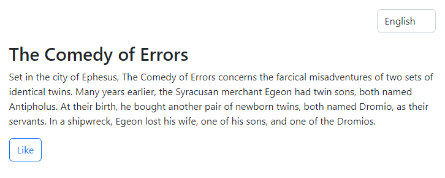
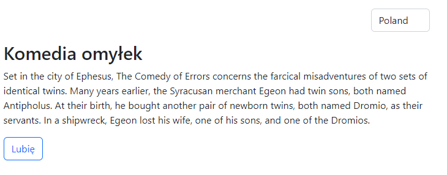
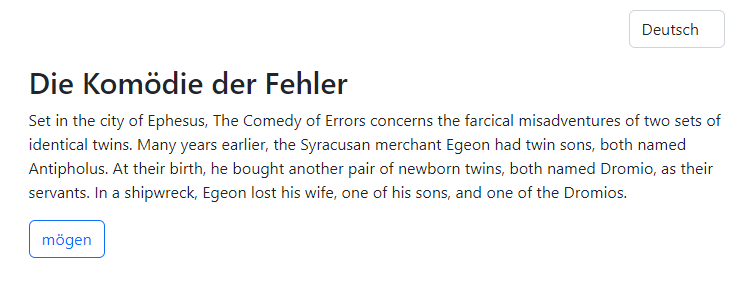

Little application with using Vue3 and internationalization-framework i18n

Description

User can change the language, after that, all text, title and button
changing too.
By clicking button in console you'll see the message in the corresponding
language

The title will be translated in the frontend,
the text will be translated via an api using express

